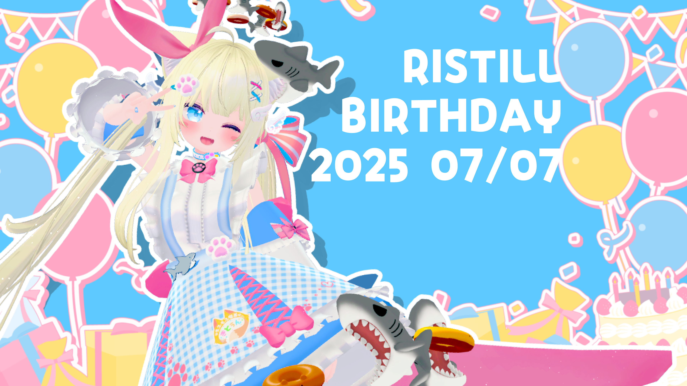

# Mosaic Art Generator

<div align="center">

[](https://github.com/naporin0624/mosaic-art-rust/actions/workflows/ci.yml)
[](https://naporin0624.github.io/mosaic-art-rust/badges/coverage.svg)
[](https://opensource.org/licenses/MIT)
[](https://www.rust-lang.org)
[](https://github.com/naporin0624/mosaic-art-rust/stargazers)
[](https://github.com/naporin0624/mosaic-art-rust/network)
[](https://github.com/naporin0624/mosaic-art-rust/issues)
[](https://github.com/naporin0624/mosaic-art-rust/commits/main)
[](https://www.rust-lang.org/)
[](https://github.com/naporin0624/mosaic-art-rust)
[](https://github.com/naporin0624/mosaic-art-rust)
[](https://github.com/naporin0624/mosaic-art-rust)

</div>

A high-performance mosaic art generator written in Rust that creates stunning mosaic images by intelligently replacing sections of a target image with smaller material images based on perceptual color similarity.

## Example Output

Transform any image into a detailed mosaic composed of thousands of smaller images:

<div align="center">

| Original Image | Generated Mosaic (24,000 tiles) |
|:--------------:|:-------------------------------:|
|  |  |

</div>

## Features

- **Perceptual Color Matching**: Uses Lab color space with k-d tree (O(log n) search) for perceptually accurate matching
- **Parallel Processing**: Automatic parallelization with Rayon for multi-core performance
- **Smart Placement Algorithm**: Multi-factor scoring system considering:
  - Color distance (primary factor)
  - Usage count limits to ensure variety
  - Adjacency penalties to prevent clustering of similar images
- **Color Adjustment**: Advanced HSV-based color adjustment to better match target regions
- **Similarity Database**: Pre-computed similarity matrix with JSON persistence for faster subsequent runs
- **Post-placement Optimization**: Simulated annealing algorithm for iterative improvement
- **Real-time Visualization**: ASCII grid display and progress tracking with ETA
- **Aspect Ratio Matching**: Intelligent filtering with fallback strategies
- **SIMD Optimization**: Hardware-accelerated image resizing via fast_image_resize

## Installation

### Prerequisites

- Rust 1.88.0 or later
- Cargo 0.89.0 or later

### Using mise (Recommended)

```bash
# Clone the repository
git clone <repository-url>
cd mosaic-rust

# Set up development environment
mise install
mise trust

# Build optimized release version
cargo build --release
```

### Manual Installation

```bash
# Install Rust via rustup
curl --proto '=https' --tlsv1.2 -sSf https://sh.rustup.rs | sh

# Build the project
cargo build --release
```

## Quick Start

```bash
# Basic usage with default settings
./target/release/mosaic-rust \
  --target photo.jpg \
  --material-src ./materials \
  --output mosaic.jpg

# Recommended settings for high quality
./target/release/mosaic-rust \
  --target photo.jpg \
  --material-src ./materials \
  --output mosaic.jpg \
  --grid-w 80 \
  --grid-h 60 \
  --max-materials 1500 \
  --adjacency-penalty-weight 0.25 \
  --color-adjustment-strength 0.4 \
  --optimization-iterations 2000
```

## Example: High-Resolution Birthday Mosaic

This example demonstrates the generator's capabilities using a birthday artwork as the target image, showcasing the detailed color matching and optimization features.

| Original Image | Generated Mosaic (24,000 tiles) |
|:--------------:|:-------------------------------:|
|  |  |

### Command Used
```bash
./target/release/mosaic-rust \
  --target ./mosaic.png \
  --material-src ./sozai \
  --output mosaic_24000_4.png \
  --grid-w 206 \
  --grid-h 116 \
  --max-materials 2849 \
  --max-usage-per-image 9 \
  --adjacency-penalty-weight 0.25 \
  --optimization-iterations 2000 \
  --color-adjustment-strength 0.4
```

This high-resolution mosaic was created for the [Ristill Birthday 2025](https://ristill.club/2025) website, demonstrating the generator's ability to handle complex artwork with vibrant colors and intricate details. The 206×116 grid creates a mosaic with 23,896 individual tiles, each carefully selected from a collection of 2,849 material images.

## Command Line Options

### Required Arguments

| Option | Short | Description |
|--------|-------|-------------|
| `--target` | `-t` | Path to the target image |
| `--material-src` | `-m` | Directory containing material images |
| `--output` | `-o` | Output mosaic image path |

### Grid Configuration

| Option | Description | Default |
|--------|-------------|---------|
| `--grid-w` | Number of tiles horizontally | 50 |
| `--grid-h` | Number of tiles vertically | 28 |

### Material Selection

| Option | Description | Default |
|--------|-------------|---------|
| `--max-materials` | Maximum number of materials to load | 500 |
| `--aspect-tolerance` | Aspect ratio tolerance (0.1 = ±10%) | 0.1 |

### Placement Constraints

| Option | Description | Default |
|--------|-------------|---------|
| `--max-usage-per-image` | Maximum times each material can be used | 3 |
| `--adjacency-penalty-weight` | Weight for adjacency penalty (0.0-1.0) | 0.3 |

### Optimization Settings

| Option | Description | Default |
|--------|-------------|---------|
| `--enable-optimization` | Enable simulated annealing optimization | true |
| `--optimization-iterations` | Maximum optimization iterations | 1000 |

### Performance & Quality

| Option | Description | Default |
|--------|-------------|---------|
| `--similarity-db` | Path to similarity database JSON | similarity_db.json |
| `--rebuild-similarity-db` | Force rebuild of similarity database | false |
| `--color-adjustment-strength` | Color adjustment strength (0.0-1.0) | 0.3 |

### Display Options

| Option | Description | Default |
|--------|-------------|---------|
| `--show-time` | Show processing time and ETA | true |
| `--show-grid` | Show real-time ASCII grid progress | true |

## Advanced Examples

### Ultra High Quality (Slow)

```bash
./target/release/mosaic-rust \
  --target photo.jpg \
  --material-src ./materials \
  --output ultra_quality.jpg \
  --grid-w 150 \
  --grid-h 100 \
  --max-materials 5000 \
  --max-usage-per-image 2 \
  --adjacency-penalty-weight 0.4 \
  --optimization-iterations 10000 \
  --color-adjustment-strength 0.5
```

### Fast Preview Mode

```bash
./target/release/mosaic-rust \
  --target photo.jpg \
  --material-src ./materials \
  --output preview.jpg \
  --grid-w 30 \
  --grid-h 20 \
  --enable-optimization false \
  --adjacency-penalty-weight 0.0 \
  --color-adjustment-strength 0.0 \
  --show-grid false \
  --show-time false
```

### Portrait Orientation (9:16)

```bash
./target/release/mosaic-rust \
  --target portrait.jpg \
  --material-src ./materials \
  --output portrait_mosaic.jpg \
  --grid-w 56 \
  --grid-h 100 \
  --aspect-tolerance 0.05 \
  --max-usage-per-image 2
```

### Unique Tiles Only

```bash
./target/release/mosaic-rust \
  --target photo.jpg \
  --material-src ./materials \
  --output unique_tiles.jpg \
  --max-usage-per-image 1 \
  --max-materials 3000
```

## Architecture & Algorithms

### Color Space & Matching

The generator uses the **Lab color space** for perceptually uniform color matching:
- L*: Lightness (0-100)
- a*: Green-red color component
- b*: Blue-yellow color component

A **k-d tree** with bucket size 256 provides O(log n) nearest neighbor search performance.

### Material Selection Algorithm

Each grid cell's material is selected using a multi-factor scoring system:

```
score = color_distance * (1 + usage_penalty) * (1 + adjacency_penalty)
```

Where:
- `color_distance`: Euclidean distance in Lab space
- `usage_penalty`: Increases with each use of the material
- `adjacency_penalty`: Based on similarity to adjacent tiles

### Optimization Phase

The simulated annealing algorithm:
1. Initial temperature: 1.0
2. Cooling rate: 0.95 per iteration
3. Acceptance probability: `exp(-delta / temperature)`
4. Swaps tiles to minimize total adjacency penalty

### Performance Optimizations

- **Parallel Loading**: Rayon parallelizes material image loading
- **SIMD Resizing**: fast_image_resize uses CPU vector instructions
- **Memory Efficiency**: Arc<Tile> for shared immutable data
- **Similarity Caching**: Pre-computed similarity matrix (O(n²) → O(1))

## Processing Pipeline

1. **Initialization**
   - Load materials with parallel processing
   - Filter by aspect ratio (with fallback)
   - Build/load similarity database

2. **Indexing**
   - Calculate Lab colors for all materials
   - Build k-d tree for fast searching

3. **Grid Generation**
   - Divide target into grid cells
   - Calculate average Lab color per cell

4. **Material Placement**
   - Find best material for each cell
   - Consider all constraints (usage, adjacency)
   - Apply color adjustment if enabled

5. **Optimization** (if enabled)
   - Run simulated annealing
   - Swap tiles to improve placement

6. **Assembly**
   - Resize materials to cell size
   - Compose final mosaic image

## Performance Tips

### For Fastest Processing
- Use `--enable-optimization false`
- Set `--adjacency-penalty-weight 0.0`
- Disable visualization with `--show-grid false`
- Limit materials with `--max-materials 200`

### For Best Quality
- Increase grid resolution (e.g., 100x75 or higher)
- Use more materials (`--max-materials 2000+`)
- Enable color adjustment (`--color-adjustment-strength 0.4-0.6`)
- Increase optimization iterations (`--optimization-iterations 5000+`)

### For Memory Efficiency
- Limit materials if RAM is constrained
- Use smaller grid sizes
- Disable similarity database with `--rebuild-similarity-db`

## Troubleshooting

### "Warning: No materials match the target aspect ratio"

```bash
# Solution 1: Increase tolerance
--aspect-tolerance 0.2  # Allow ±20% difference

# Solution 2: Check your materials
# Ensure material directory has images with similar aspect ratios
```

### Out of Memory Errors

```bash
# Reduce memory usage
--max-materials 100
--grid-w 40
--grid-h 30
```

### Slow Performance

```bash
# Quick mode settings
--enable-optimization false
--show-grid false
--adjacency-penalty-weight 0.0
--color-adjustment-strength 0.0
```

## Build from Source

### Development Build

```bash
cargo build
cargo test  # Run unit tests
cargo clippy  # Lint code
cargo fmt  # Format code
```

### Release Build with Optimizations

```bash
cargo build --release
```

The release profile includes:
- Link Time Optimization (LTO)
- Maximum optimization level (3)
- Single codegen unit for better optimization

## Project Structure

```
mosaic-rust/
├── src/
│   ├── main.rs              # CLI and orchestration
│   ├── lib.rs               # Core traits and types
│   ├── similarity.rs        # Similarity database
│   ├── adjacency.rs         # Adjacency constraints
│   ├── optimizer.rs         # Simulated annealing
│   ├── color_adjustment.rs  # HSV color adjustment
│   ├── grid_visualizer.rs   # ASCII progress display
│   └── time_tracker.rs      # Performance tracking
├── Cargo.toml               # Dependencies
├── CLAUDE.md                # AI assistant documentation
└── .claude/
    └── commands/
        └── mosaic.md        # Custom CLI commands
```

## Dependencies

- **image** (0.25): Core image I/O functionality
- **fast_image_resize** (5.0): SIMD-optimized resizing with Rayon support
- **palette** (0.7): Lab color space conversions
- **kiddo** (5.0): High-performance k-d tree
- **rayon** (1.10): Data parallelism
- **clap** (4.0): CLI argument parsing
- **indicatif** (0.17): Progress bars
- **anyhow** (1.0): Error handling
- **serde/serde_json** (1.0): JSON serialization
- **rand** (0.8): Random number generation

## Badge Setup

The project includes automated badge generation for build status and code coverage:

### Code Coverage Badge Setup

1. **Enable GitHub Pages**: Go to Settings → Pages → Source: Deploy from a branch → Branch: `gh-pages` → Save
2. **Badge URLs**: The badges are already configured for `naporin0624/mosaic-art-rust`
3. **First Run**: Push changes to trigger the coverage workflow, which will create the `gh-pages` branch automatically

The coverage badge will be available at: `https://naporin0624.github.io/mosaic-art-rust/badges/coverage.svg`

### Available Badges

- **CI Status**: Automated build and test status from GitHub Actions
- **Code Coverage**: Generated by cargo-tarpaulin and hosted on GitHub Pages
- **License**: MIT License badge
- **Rust Version**: Minimum supported Rust version (1.88.0+)
- **GitHub Stats**: Stars, forks, issues, and last commit information
- **Made with Rust**: Language identifier badge
- **Platform Support**: Cross-platform compatibility (Linux, macOS, Windows)
- **Code Size**: Size of the codebase in bytes
- **Repo Size**: Total repository size

## Contributing

Contributions are welcome! Please ensure:
- Code passes `cargo test`
- Code is formatted with `cargo fmt`
- No warnings from `cargo clippy`
- New features include tests

## License

This project is licensed under the MIT License - see below for details:

```
MIT License

Copyright (c) 2024 mosaic-rust contributors

Permission is hereby granted, free of charge, to any person obtaining a copy
of this software and associated documentation files (the "Software"), to deal
in the Software without restriction, including without limitation the rights
to use, copy, modify, merge, publish, distribute, sublicense, and/or sell
copies of the Software, and to permit persons to whom the Software is
furnished to do so, subject to the following conditions:

The above copyright notice and this permission notice shall be included in all
copies or substantial portions of the Software.

THE SOFTWARE IS PROVIDED "AS IS", WITHOUT WARRANTY OF ANY KIND, EXPRESS OR
IMPLIED, INCLUDING BUT NOT LIMITED TO THE WARRANTIES OF MERCHANTABILITY,
FITNESS FOR A PARTICULAR PURPOSE AND NONINFRINGEMENT. IN NO EVENT SHALL THE
AUTHORS OR COPYRIGHT HOLDERS BE LIABLE FOR ANY CLAIM, DAMAGES OR OTHER
LIABILITY, WHETHER IN AN ACTION OF CONTRACT, TORT OR OTHERWISE, ARISING FROM,
OUT OF OR IN CONNECTION WITH THE SOFTWARE OR THE USE OR OTHER DEALINGS IN THE
SOFTWARE.
```

## Acknowledgments

Special thanks to the Rust community and the authors of the dependencies that make this high-performance implementation possible.